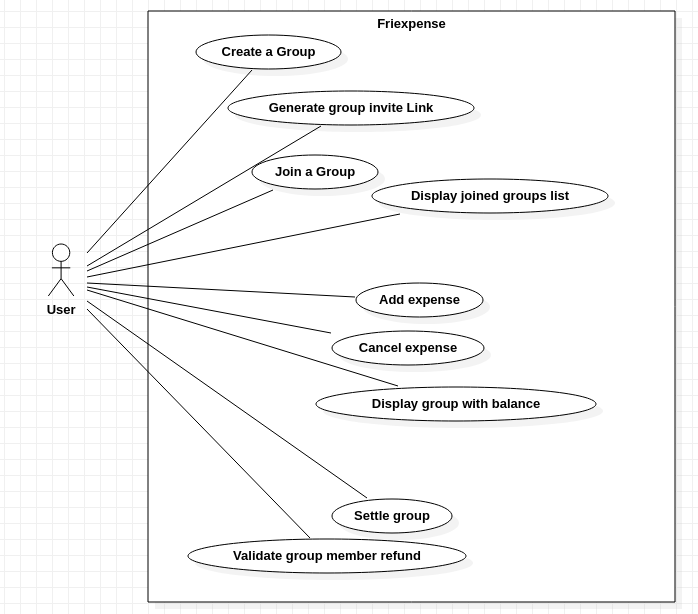

# Simplon, CDA, project business

### use `npm start` to launch the project

## Sujet

## projet-business

L'objectif pédagogique de ce projet est de créer une application en portant une attention particulière sur la couche 
business.

### Contexte

Nous souhaitons réaliser une application permettant à des groupes de personnes d'enregistrer leurs dépenses 
(dans le cadre d'un voyage, d'une sortie ou autre) afin de pouvoir indiquer au terme de l'activité qui doit combien 
à qui afin que tout le monde ait dépensé la même chose.

Voilà le diagramme de use case pour une première version de l'appli.

Une personne pourra créer un groupe et inviter d'autres personnes via un lien d'invitation. A partir de là, 
les différents membres du groupe pourront ajouter des dépenses et voir le total actuel de celles ci (et une estimation 
de la fraction que chaque membre devra payer).

Une fois l'activité terminé, on passe le group en mode faire le compte (Settle group), ce qui affichera pour chaque 
membre la somme qu'ielle devra verser à celleux ayant fait d'avantage de dépense et permettra à ces membres en question 
de valider le remboursement lorsqu'un membre lui règle sa part.

### Mise en oeuvre

Vous allez vous concentrer uniquement sur la partie API Rest (pas de front pour ce projet, sauf si vous avez très très envie).
Comme dit l'idée sera de faire à terme une couche Business (voir Domain) qui contiendra toutes les règles métiers de l'application et si elle peut être complètement découplée de l'infrastructure, c'est chouette.

Pas la peine de gérer la partie authentification sur ce projet.

Pas de restriction de langage/framework/ORM pour ce projet (sachant que si vous voulez faire les choses bien ceci dit, 
le fait d'utiliser certains framework en gardant la couche Business/Domain découplée demandera certaines adaptations)